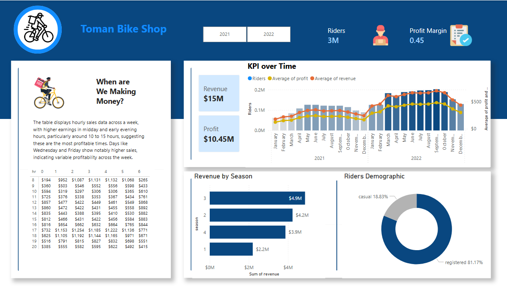

# 🚴‍♂️ Toman Bike Share – Power BI Dashboard Project

## 📌 Project Overview

This project analyzes bike-sharing data to uncover revenue patterns, rider behavior, and profitability trends. The goal is to simulate a real-world business intelligence workflow—from raw data ingestion to dashboard insights.

---

## 🎯 Objectives

* Identify **peak revenue periods**
* Analyze **rider growth trends over time**
* Understand **profitability patterns**
* Segment users into **casual vs registered riders**

---

## 🛠️ Tools & Technologies

* **SQL Server** – Data storage and transformation
* **SQL** – Data cleaning, joins, and calculations
* **Power BI** – Data modeling and visualization
* **CSV Files** – Raw data source

---

## 🔄 Data Pipeline

1. Imported raw `.csv` files into **SQL Server**
2. Performed transformations using:

   * `UNION`
   * `LEFT JOIN`
   * Calculated columns
3. Connected **Power BI** to SQL Server
4. Built data model and created DAX measures
5. Designed interactive dashboard

---

## 📊 Dashboard Features

### 🔹 KPI Cards

* Total Revenue: **$15M**
* Total Profit: **$10.45M**
* Total Riders: **3M**
* Profit Margin: **0.45**

### 🔹 Visual Insights

* **KPI Over Time**

  * Revenue, Riders, and Profit trends (2021–2022)
* **Revenue by Season**

  * Identifies highest earning seasons
* **Rider Demographics**

  * Registered vs Casual users
* **Hourly Sales Analysis**

  * Peak earning hours: *10 AM – 3 PM*
  * High-performing days: *Wednesday & Friday*

---

## 📸 Dashboard Preview



---

## 💡 Key Insights

* Midday hours generate the highest revenue
* Registered users contribute over **80%** of total riders
* Revenue peaks during specific seasonal periods
* Profit trends closely follow rider growth

---

## 📂 Repository Structure

```
📁 Toman-Bike-Share-Project
│── 📄 Toman_Bike_Share_Dashboard.pbix
│── 📄 data_import.sql
│── 📄 data_transformation.sql
│── 📄 sample_data.csv
│── 📁 images/
│    └── dashboard.png
│── 📄 README.md
```

---

## 🚀 How to Use

1. Run SQL scripts to prepare the dataset
2. Open `.pbix` file in Power BI
3. Refresh data connection (if needed)
4. Explore the dashboard interactively

---

## 📚 Learning Outcomes

* Hands-on experience with **ETL process**
* Writing optimized SQL queries
* Data modeling in Power BI
* Designing business-focused dashboards

---

## 🔗 Project Reference

Inspired by: https://www.youtube.com/watch?v=jdGJWloo-OU

---

## 🙌 Connect With Me

If you found this project interesting, feel free to connect with me on LinkedIn!
